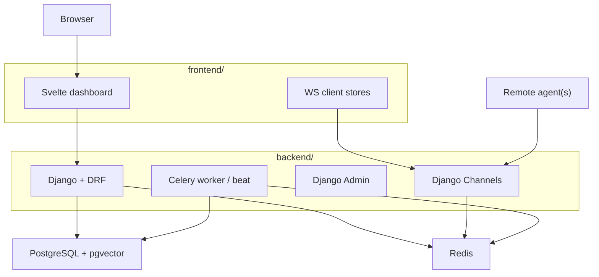

# Current Architecture

This document describes the current repository structure as it exists today.
It is intentionally separate from the target product direction in [to-be-architecture.md](/C:/Users/agics/Desktop/workspace/01.%20git/HyperCube/docs/to-be-architecture.md:1).

## Summary

HyperCube is currently a split-stack project:

- `frontend/`: Svelte dashboard and client-side WebSocket logic
- `backend/`: Django backend with DRF, Channels, JWT auth, Celery integration, and admin
- `nginx/`: reverse proxy configuration
- `docker-compose.yml`: local runtime dependencies for PostgreSQL, Redis, backend, worker, and beat

The codebase is already modeled around a central server plus remote agents, even though some infrastructure and deployment paths are still being aligned.

## Current Runtime Shape

## Frontend

The frontend is built with SvelteKit and serves as the operator-facing dashboard.

Key responsibilities:

- login and JWT token handling
- server selection after authentication
- live topology visualization
- modal-based system and container inspection
- WebSocket connection management and reconnect behavior

Important files:

- [frontend/src/routes/+page.svelte](/C:/Users/agics/Desktop/workspace/01.%20git/HyperCube/frontend/src/routes/+page.svelte:1): main dashboard page
- [frontend/src/lib/stores/ws-store.ts](/C:/Users/agics/Desktop/workspace/01.%20git/HyperCube/frontend/src/lib/stores/ws-store.ts:1): WebSocket store and reconnect logic
- [frontend/src/lib/stores/global-events.ts](/C:/Users/agics/Desktop/workspace/01.%20git/HyperCube/frontend/src/lib/stores/global-events.ts:1): global agent event handling

## Backend

The backend is a Django application with a domain-oriented app layout.

Installed domain apps:

- `apps.users`
- `apps.agents`
- `apps.containers`
- `apps.metrics`
- `apps.common`

Key runtime features:

- DRF APIs
- JWT authentication
- Django admin through `django-unfold`
- Channels-based WebSocket endpoints
- Redis-backed channel layer
- Celery periodic jobs for metrics and agent lifecycle maintenance

Important files:

- [backend/config/settings/base.py](/C:/Users/agics/Desktop/workspace/01.%20git/HyperCube/backend/config/settings/base.py:1)
- [backend/config/urls.py](/C:/Users/agics/Desktop/workspace/01.%20git/HyperCube/backend/config/urls.py:1)
- [backend/apps/agents/viewsets.py](/C:/Users/agics/Desktop/workspace/01.%20git/HyperCube/backend/apps/agents/viewsets.py:1)
- [backend/apps/containers/viewsets.py](/C:/Users/agics/Desktop/workspace/01.%20git/HyperCube/backend/apps/containers/viewsets.py:1)

## Data and Messaging

Current responsibilities are split as follows:

| Concern | Current Storage / Transport |
| --- | --- |
| user accounts and roles | PostgreSQL |
| agent registry | PostgreSQL |
| container requests and templates | PostgreSQL |
| latest live state | Redis and WebSocket messages |
| historical metrics | PostgreSQL via Celery flush |
| background maintenance | Celery + Redis |

## Roles

The current permission model is intentionally simple:

- `admin`: operational authority
- `user`: authenticated limited user

Compatibility aliases still exist in code for older permission names, but the active model is effectively two-tier.

See [backend/apps/common/permissions.py](/C:/Users/agics/Desktop/workspace/01.%20git/HyperCube/backend/apps/common/permissions.py:1).

## Local Compose

The root [docker-compose.yml](/C:/Users/agics/Desktop/workspace/01.%20git/HyperCube/docker-compose.yml:1) currently defines:

- PostgreSQL
- Redis
- backend
- celery worker
- celery beat

This file is mainly useful for backend-side local runtime dependencies and service wiring.

## Honest Status

The current architecture is promising, but not fully polished yet.
A few areas are still in transition:

- some documentation still reflects an older single-app implementation
- frontend build/deployment paths need reconciliation
- production compose and production settings still need tightening

Those gaps do not erase the direction of the project, but they do matter for delivery quality.
