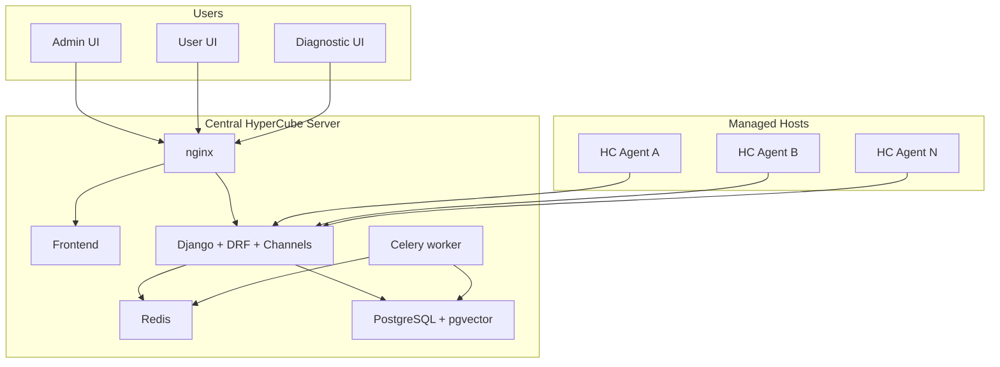

# Target Architecture

This document describes the intended product direction for HyperCube.
It is the "where we are going" document, not a claim that every piece is already complete in the current repository.

## Product Goal

HyperCube aims to become a central operations platform for teams that run containers across multiple servers.

The intended experience is:

- install a lightweight agent on each host
- connect those agents to one central backend
- monitor all hosts from a single dashboard
- let users request container operations without direct Docker access
- require admin approval before the agent executes create or delete operations
- later extend the platform with anomaly detection, forecasting, semantic search, and LLM-assisted operational analysis

## Core Personas

### Admin

- view all connected servers and containers
- approve or reject user requests
- manage templates
- access operational and diagnostic views

### User

- request container creation or deletion
- monitor only their own resources and requests
- avoid direct Docker CLI usage

### Developer / Operator

- inspect system internals and Redis-backed transient state
- verify agent connectivity and command flow
- debug lifecycle issues

## Intended System Shape

## Key Product Flows

### 1. Monitoring

- each agent collects Docker and host-level metrics
- the agent sends deltas and command responses over WebSocket
- the backend redistributes live events to the UI
- selected state is cached in Redis and periodically flushed into PostgreSQL

### 2. Controlled Container Operations

The intended lifecycle is:

1. a user submits a request
2. an admin approves or rejects it
3. the backend dispatches a command to the target agent
4. the agent reports progress and final result
5. the system records ownership and lifecycle metadata

This is a very different product posture from direct container control.
That approval boundary is one of the core ideas of the project.

### 3. AI and Analytical Extensions

The planned analytical layer includes:

- anomaly detection on logs and behavior
- resource usage forecasting
- semantic search over operational history
- natural-language Q&A over stored metrics and events

## Domain Model Direction

The target backend model centers on:

- `Agent`
- `ContainerTemplate`
- `ContainerRequest`
- `Container`
- `CustomUser`
- metrics history tables

That model supports both operational monitoring and approval-based orchestration.

## Phased Direction

### Phase 1

- Django foundation
- PostgreSQL and Redis wiring
- auth and admin
- core APIs

### Phase 2

- agent registration
- live telemetry
- server switching and active/offline handling

### Phase 3

- role-based UI separation
- container request lifecycle
- approval workflow
- user-facing request pages

### Phase 4

- deeper monitoring views
- alerting
- richer system metrics

### Phase 5

- higher-fidelity 3D visualization
- server -> project -> container clustering
- better resource mapping and LOD

### Phase 6

- AI analysis through Celery and vector storage
- anomaly detection
- prediction
- natural-language operational queries

## What Matters Most

The most important architectural idea in HyperCube is not the 3D UI.
It is the combination of:

- central visibility
- distributed agents
- approval-based operations
- extensibility toward analytical tooling

That is the real product thesis of the project.
