# HyperCube To-Be 시스템 아키텍처

> 이 문서는 HyperCube의 **목표 시스템 구조**를 정의합니다.
> 비개발자도 전체 그림을 이해할 수 있도록 작성했으며, 각 섹션 하단에 개발자용 상세 내용을 포함합니다.

---

## 1. 한눈에 보는 전체 구조

### 쉽게 말하면

현재 HyperCube은 **서버 1대만** 모니터링합니다.
To-Be는 **여러 서버를 하나의 대시보드**에서 모니터링하고, 사용자가 직접 컨테이너를 요청해서 받을 수 있는 시스템입니다.

각 서버에 "Agent"라는 작은 프로그램을 설치하면, Agent가 해당 서버의 상태를 수집해서 중앙 서버로 보내줍니다. 사용자는 웹에서 템플릿을 골라 컨테이너를 요청하고, 관리자가 승인하면 Agent가 실제 컨테이너를 생성합니다. 화면은 역할에 따라 셋으로 나뉩니다:

- **관리자 페이지**: 모든 서버/컨테이너 모니터링 + 사용자 요청 승인/반려
- **사용자 페이지**: 컨테이너 생성/삭제 요청 + 자기 컨테이너 모니터링
- **개발자 페이지**: 시스템 내부 상태(Redis 캐시, 명령 라우팅 등) 진단

### 전체 시스템 구성도

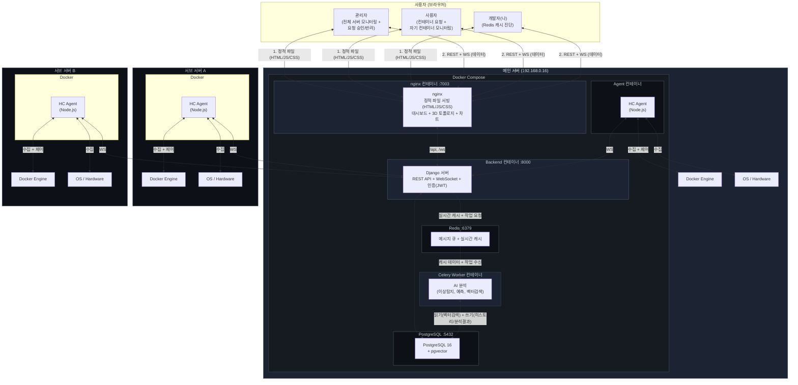

> **시각화 버전**
>
> 

---

## 2. 핵심 구성 요소

### 2.1 HC Agent (각 서버에 설치)

#### 역할

Agent는 각 서버에 설치되는 **경량 데이터 수집기**입니다.
서버의 CPU, 메모리, 디스크 상태와 Docker 컨테이너 정보를 수집하여 중앙 서버로 전송합니다.

#### 동작 흐름

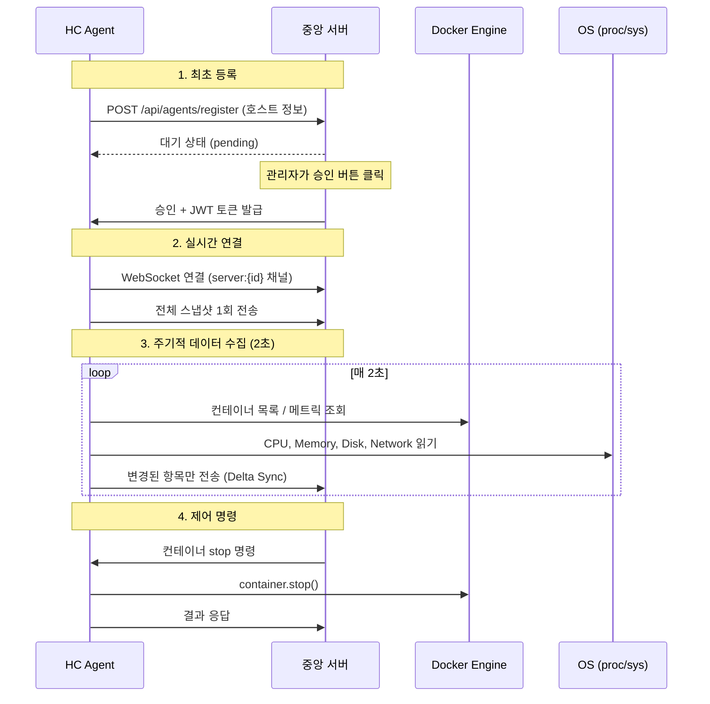

#### 개발자 상세

| 항목 | 내용 |
|------|------|
| 런타임 | Node.js (경량 데몬) |
| 배포 | Docker 컨테이너 (docker-compose) |
| Docker 수집 | dockerode 싱글톤 인스턴스 |
| System 수집 | /proc 직접 읽기 (컨테이너 마운트) 또는 호스트 직접 실행 |
| 데이터 전송 | WebSocket, Delta Sync (변경분만 전송) |
| 재접속 | 전체 스냅샷 1회 전송으로 정합성 보장 |
| 인증 | JWT agent token (auto-register 후 발급) |

```yaml
# Agent docker-compose.yml
services:
  hc-agent:
    image: hypercube/agent:latest
    restart: unless-stopped
    privileged: true
    pid: host
    volumes:
      - /var/run/docker.sock:/var/run/docker.sock:ro
      - /proc:/host/proc:ro
      - /etc/hostname:/host/etc/hostname:ro
      - /var/run/utmp:/var/run/utmp:ro
    environment:
      - HC_SERVER_URL=http://central-server:8000
```

---

### 2.2 중앙 서버 (HyperCube Main)

#### 역할

모든 Agent의 데이터를 수신하고, 웹 대시보드를 통해 사용자에게 보여주는 **허브** 역할입니다.
Frontend, Backend(Django), Celery Worker, Redis, PostgreSQL, Agent 6개의 Docker 컨테이너로 구성되며, nginx가 앞에서 라우팅합니다.

#### 컨테이너 구성

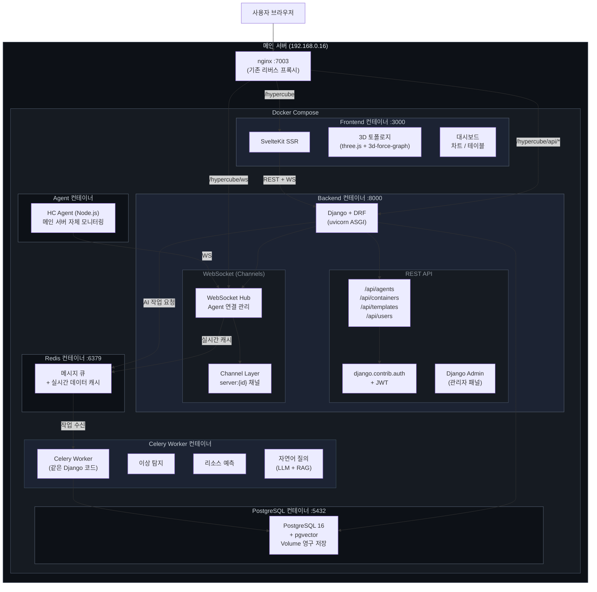

#### 각 컨테이너 역할

| 컨테이너 | 기술 | 역할 | 포트 |
|----------|------|------|------|
| **Frontend** | SvelteKit (adapter-node) | SSR, 3D 토폴로지, 대시보드 UI | :3000 |
| **Backend** | Django + DRF + Channels | REST API, WebSocket Hub, 인증 | :8000 |
| **Celery Worker** | Celery (같은 Django 코드) | AI 분석 (이상탐지, 예측, 벡터검색) | - |
| **Redis** | Redis 7 | Celery 메시지 큐 + Agent 실시간 데이터 캐시 | :6379 |
| **PostgreSQL** | PostgreSQL 16 + pgvector | 데이터 영구 저장 + 벡터 검색 | :5432 |
| **Agent** | Node.js (경량 데몬) | 메인 서버 자체의 Docker/System 데이터 수집 | - |

#### nginx 라우팅

```
nginx (:7003)
├── /hypercube           → Frontend :3000   (SSR 페이지)
├── /hypercube/api/*     → Backend :8000    (Django REST API)
├── /hypercube/admin     → Backend :8000    (Django Admin 패널)
└── /hypercube/ws        → Backend :8000    (Django Channels WebSocket)
```

사용자는 포트 하나(7003)로 모든 기능에 접근합니다. CORS 문제 없이 같은 도메인에서 동작합니다.

#### 개발자 상세

**Frontend 컨테이너**

| 항목 | 내용 |
|------|------|
| 프레임워크 | SvelteKit 2 + Svelte 5 (runes mode) |
| 빌드 | adapter-node |
| 3D | 3d-force-graph + three.js |
| Backend 통신 | REST API 호출 + WebSocket 연결 (Backend :8000) |

**Backend 컨테이너 (Django)**

| 항목 | 내용 |
|------|------|
| 프레임워크 | Django 5 + Django REST Framework |
| ASGI 서버 | uvicorn (비동기 지원) |
| WebSocket | Django Channels (Redis Channel Layer) |
| DB | PostgreSQL 16 + pgvector (Django ORM) |
| 인증 | django.contrib.auth + djangorestframework-simplejwt |
| Admin | Django Admin 패널 (Agent/사용자/템플릿 관리) |
| AI 작업 | Celery Worker에 비동기 위임 (Redis 큐) |

**Django가 제공하는 내장 기능 (직접 구현 불필요)**

| 기능 | Django 내장 | 직접 구현 시 |
|------|-----------|------------|
| 사용자 인증 | `django.contrib.auth` | JWT 미들웨어 직접 작성 |
| 권한 관리 | Permission, Group 모델 | 역할 체크 로직 직접 작성 |
| Admin 페이지 | `django.contrib.admin` | 관리 UI 직접 개발 |
| DB 마이그레이션 | `python manage.py migrate` | SQL 수동 관리 |
| ORM | Django ORM (자동 쿼리) | SQL 직접 작성 |
| CSRF/XSS 보호 | 내장 미들웨어 | 직접 구현 |

**Agent 컨테이너 (메인 서버용)**

메인 서버도 서브 서버와 동일한 Agent를 실행합니다. Agent는 Node.js 유지 (dockerode가 Node 전용).
"메인 서버는 특별 취급"이라는 예외 없이, 모든 서버가 같은 방식으로 모니터링됩니다.

**Celery Worker 컨테이너 (AI 분석)**

Django와 같은 코드를 사용하지만 별도 프로세스에서 실행됩니다.
CPU를 많이 먹는 AI 연산을 분리해서 Backend의 API/WS 응답이 느려지지 않게 합니다.

```
Django: "이 로그 이상 탐지 해줘" ──→ Redis (큐) ──→ Celery Worker 처리
                                                      │
                                         결과 → DB 저장 + WS로 알림
```

| 기능 | 설명 | 기술 |
|------|------|------|
| 로그 이상 탐지 | 평소와 다른 로그 패턴 자동 감지 | 벡터 유사도 검색 (pgvector) |
| 리소스 예측 | CPU/Memory 사용 추이 기반 예측 | 시계열 분석 (Prophet, ARIMA) |
| 자연어 질의 | "어제 메모리 터진 서버 어디?" | LLM API (Claude/GPT) + Django ORM |
| 장애 원인 분석 | 알림 발생 시 유사 과거 사례 자동 조회 | 벡터 검색 + RAG |

**Redis 컨테이너**

| 용도 | 설명 |
|------|------|
| Celery 메시지 큐 | Django → Redis → Celery Worker 작업 전달 |
| 실시간 데이터 캐시 | Agent 데이터 최신 상태 저장 (DB 부하 감소) |
| Channels 브로커 | Worker 확장 시 WS 메시지 전달 (향후) |

---

### 2.3 데이터 흐름

#### 실시간 모니터링 데이터 (WebSocket)

DB를 거치지 않고 Agent에서 브라우저까지 실시간 전달됩니다.

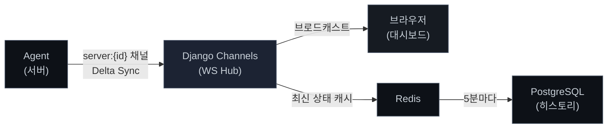

전송 데이터 (통합 메시지):

```json
{
  "type": "system",
  "serverId": "server-16",
  "timestamp": "2026-03-24T10:00:00Z",
  "cpu": { "usage": 45.2, "cores": [30, 50, 40, 60] },
  "memory": { "total": 16384, "used": 8192, "percent": 50.0 },
  "disk": { "total": "500G", "used": "200G", "percent": 40 },
  "network": { "rx": 102400, "tx": 51200 },
  "containers": [
    { "id": "abc123", "name": "nginx", "status": "running", "cpu": 2.1, "memory": 128 }
  ]
}
```

#### 설정/관리 데이터 (REST + PostgreSQL)

사용자 계정, 템플릿, 알림 설정 등은 REST API를 통해 DB에 저장됩니다.

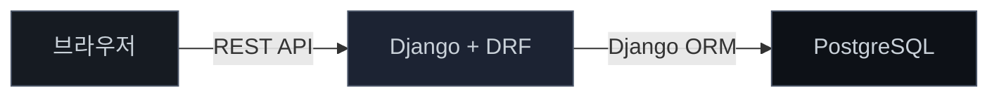

---

## 2.5 사용자 / 관리자 / 개발자 페이지 분리

웹 화면은 로그인 사용자 role에 따라 자동 분기됩니다.

| 페이지 | URL | 사용자 | 책임 |
|---|---|---|---|
| **관리자 페이지** | `/` (admin role 진입 시) | role=admin | 전체 서버/컨테이너 모니터링 + 사용자 컨테이너 요청 승인/반려 + 템플릿 관리 |
| **사용자 페이지** | `/` (user role 진입 시) | role=user | 컨테이너 생성/삭제 요청 + 자기 컨테이너만 모니터링 |
| **개발자 페이지** | `/dev` | admin only | Redis 캐시 / Agent 레지스트리 / pending 명령 등 시스템 내부 진단 |

#### 권한 모델

```
admin
  ├─ 메인 페이지 (전체 서버 모니터링)
  ├─ 승인 페이지 (요청 큐)
  ├─ 템플릿 관리
  └─ 개발자 페이지 (/dev)

user
  ├─ 사용자 페이지 (자기 컨테이너 모니터링)
  └─ 요청 폼 (컨테이너 생성/삭제 요청)
```

회원가입은 없음. 운영자가 Django admin 또는 시드 스크립트로 계정 생성.
다른 플랫폼(예: SSO, OAuth) 연동은 추후 도입 시 동일한 role 체계로 매핑.

---

## 2.6 컨테이너 lifecycle (요청 → 승인 → 배포 → 삭제)

사용자가 직접 docker 명령을 치지 않습니다. 모든 컨테이너 생성/삭제는
**요청 → 관리자 승인 → Agent 명령 → 결과 회신**의 비동기 흐름을 따릅니다.

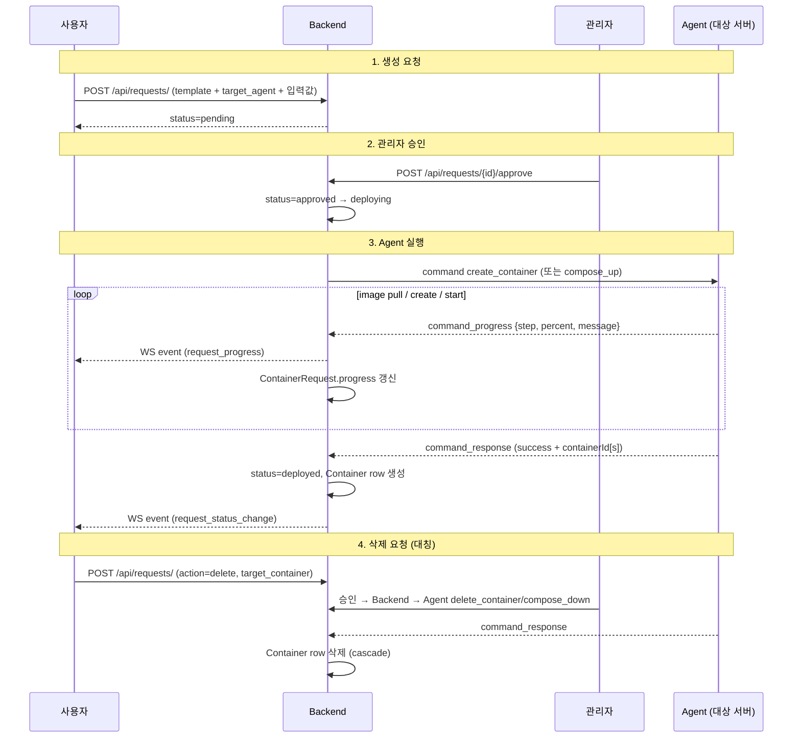

#### 핵심 모델

- **`ContainerTemplate`** — admin이 등록. 단일 image (kind=simple) 또는
  docker-compose 전체 (kind=compose). `image_options` / `env_schema` /
  `port_schema`로 사용자 입력 폼이 자동 생성됨.
- **`ContainerRequest`** — 사용자 제출. action(create/delete) +
  status(pending/approved/deploying/deployed/failed/rejected) +
  progress_message/percent.
- **`Container`** (기존) — `requester` + `created_via_request` 추가로
  "누가 요청해서 만든 컨테이너인지" 추적.

#### Agent 신규 명령

`docs/agent-protocol.md` 참조. 4종 추가:

| command | 용도 |
|---|---|
| `create_container` | 단일 컨테이너 생성 (image, env, ports, volumes, name) |
| `compose_up` | docker-compose YAML로 서비스 그룹 생성 |
| `delete_container` | 단일 컨테이너 삭제 |
| `compose_down` | compose 그룹 통째 삭제 |

긴 작업(image pull 등)에는 `command_progress` 비동기 이벤트로 진행률 보고.

#### 진행 상황 표시

- Backend는 `ContainerRequest.progress_message` / `progress_percent`를
  기존 `/ws/global/` 채널로 broadcast (`request_progress` 이벤트).
- 사용자 페이지가 자기 요청 progress bar로 시각화.
- 새로고침해도 DB에 마지막 progress가 남아있어 동일 상태 복원.

---

## 3. 주요 기능

### 3.1 멀티서버 모니터링

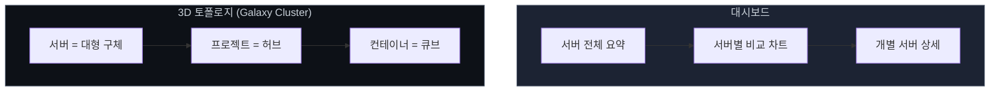

| 기능 | 설명 |
|------|------|
| 서버 통합 뷰 | 모든 서버의 CPU/Mem/Disk를 한 화면에서 요약 |
| 서버 비교 | 서버 간 리소스 사용량을 차트로 비교 |
| 서버 전환 | 헤더 드롭다운으로 특정 서버 선택, 기존 뷰 그대로 사용 |
| GPU 모니터링 | nvidia-smi 연동 (GPU 있는 서버만) |
| 알림 | CPU/Mem/Disk 임계치 초과 시 알림 발생 |

### 3.2 3D 시각화 (Galaxy Cluster)

#### 쉽게 말하면

서버를 **은하계**처럼 시각화합니다.
서버는 큰 행성, 프로젝트는 위성 허브, 컨테이너는 작은 큐브로 표시됩니다.
색상과 크기로 서버 상태를 직관적으로 파악할 수 있습니다.

#### 리소스 시각 매핑

| 리소스 | 시각 표현 |
|--------|----------|
| CPU 사용률 | 색상 그라디언트 (청록 → 노랑 → 주황 → 빨강) |
| Memory | 서버: glow 반경 / 컨테이너: 노드 크기 |
| 위험 상태 | 펄스 애니메이션 + 경고 링 |

#### LOD (Level of Detail) - 줌 레벨별 표시

| 거리 | 표시 내용 |
|------|----------|
| 멀리 (>400) | 서버 노드만 보임, 색상/크기로 부하 판단 |
| 중간 (150~400) | 서버 + 프로젝트 허브, 컨테이너는 점으로 표시 |
| 가까이 (<150) | 모든 노드 풀 렌더링 + 미니 게이지 바 |

#### 컨테이너 그룹핑 우선순위

| 순위 | 방식 | 설명 |
|------|------|------|
| 1 | `com.docker.compose.project` | Docker Compose 프로젝트 기준 |
| 2 | `dcm.group` 라벨 | 사용자가 직접 지정한 그룹 |
| 3 | Docker network | 같은 네트워크에 속한 컨테이너 |
| 4 | Image prefix | 이미지 이름 앞부분 기준 |
| 5 | 컨테이너명 prefix | 이름 앞부분 기준 (fallback) |

### 3.3 비전문가용 Docker 관리 (요청-승인 흐름)

#### 쉽게 말하면

Docker를 모르는 사람도 **템플릿을 골라 요청만 하면**, 관리자가 승인한 뒤
Agent가 알아서 컨테이너를 만들어 줍니다. 사용자는 직접 docker 명령을
치지 않습니다.

#### 사용자 측 5단계

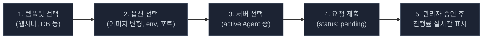

상세한 모델/시퀀스/Agent 명령은 **§2.6 컨테이너 lifecycle** 참조.

| 기능 | 설명 |
|------|------|
| 템플릿 카탈로그 | admin이 등록한 템플릿(simple/compose 둘 다). 모든 사용자에게 공개 |
| 템플릿 작성/수정 | admin only. 사용자는 사용만 |
| 입력 폼 자동 생성 | 템플릿의 `image_options` / `env_schema` / `port_schema`로 폼이 동적으로 그려짐 |
| 서버 선택 | 사용자가 active Agent 중 하나 선택 (제한 없음, 격리 안 함) |
| 진행률 표시 | image pull / create / start 단계별 progress (Agent → `command_progress` 이벤트) |
| 삭제 | 사용자가 자기 컨테이너 삭제도 **요청** → admin 승인 → Agent 실행. 직접 삭제 불가 |
| Compose 지원 | admin이 compose YAML 통째로 등록. 사용자는 그룹 단위로 요청/삭제 |
| 향후 (Phase 4+) | 업데이트(image 최신 태그) / 롤백 / 사용량 알림 |

### 3.4 인증 & 권한

#### 권한 구조 (2단계로 단순화)

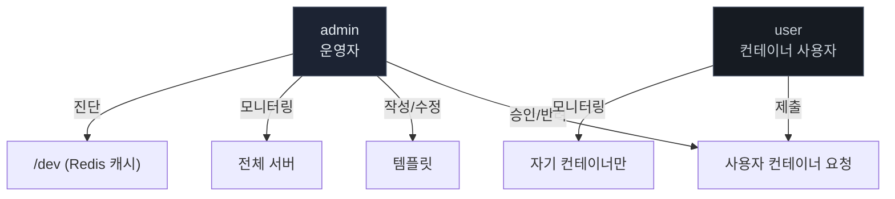

| 역할 | 할 수 있는 것 | 할 수 없는 것 |
|------|-------------|-------------|
| **admin** | 전체 서버/컨테이너 모니터링, 컨테이너 요청 승인/반려, 템플릿 CRUD, /dev 진단 페이지, 사용자 계정 관리 (Django admin) | - |
| **user** | 컨테이너 생성/삭제 요청 제출, 자기 컨테이너 모니터링/상세, 자기 요청 진행률 확인 | 다른 사용자 컨테이너, 서버 직접 제어, 템플릿 작성, /dev 진입 |

#### 회원가입과 외부 연동

- 회원가입 폼 없음. **운영자가 Django admin 또는 시드 스크립트로 직접 계정 생성**
- 향후 SSO/OAuth 등 외부 플랫폼 연동 시, 같은 admin/user 2단계 role로 매핑
- 기본 시드 계정: `admin` (admin), `agics` (admin), `agics1` (user)

#### Agent 인증 (참고)

사용자 계정과 별개로 Agent 자체 인증이 있음 (token 기반). Agent는
자동 등록되어 즉시 token을 발급받고 WS로 데이터 송신을 시작.
관리자 수동 승인 단계 없음. 자세한 내용 §2.1, §2.2 참조.

---

## 4. 데이터 저장 구조

### 실시간 vs 영구 데이터

| 데이터 | 저장 위치 | 이유 |
|--------|----------|------|
| CPU/Mem/Disk 메트릭 | WebSocket (메모리) | 실시간 표시용, 저장 불필요 |
| 컨테이너 상태 | WebSocket (메모리) | 실시간 표시용, 저장 불필요 |
| Agent 등록 정보 | PostgreSQL | 서버 재시작 후에도 유지 필요 |
| 사용자 계정/권한 | PostgreSQL | 영구 보관 |
| 템플릿 | PostgreSQL | JSON 형태로 저장 (JSONB 타입) |
| 알림 설정 | PostgreSQL | 서버/전역 임계치 |
| 알림 히스토리 | PostgreSQL | 이력 조회용 |
| 감사 로그 | PostgreSQL | who/when/what 기록 |

### DB 스키마 (주요 테이블)

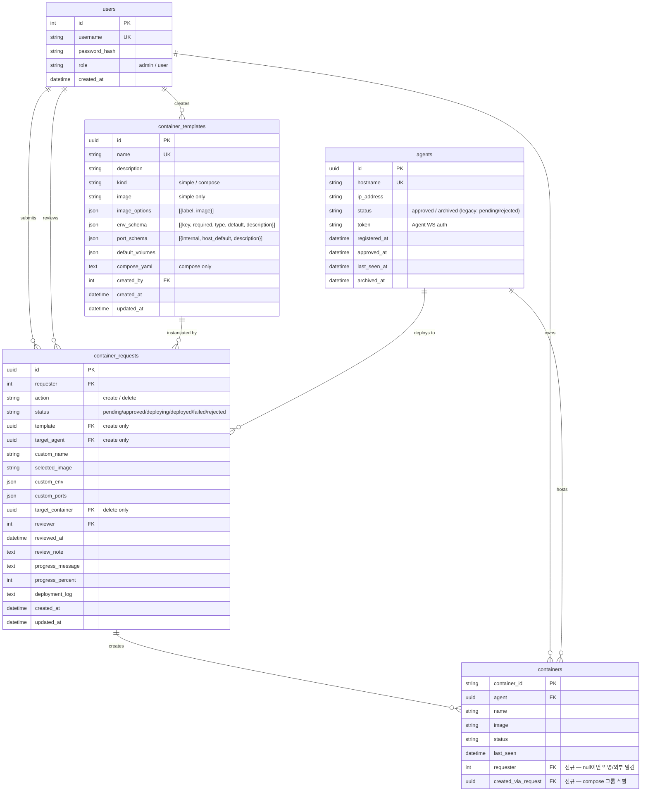

#### 기존 테이블 변경/제거

- `agents.status` 열거: 자동 승인 정책 이후 `approved` 또는 `archived`만
  실질적으로 사용. `pending`/`rejected`는 마이그레이션으로 정리됨.
- `users.role` 열거: `super_admin`/`server_admin`/`viewer` → `admin`/`user`로 단순화 (마이그레이션).
- `server_assignments` 테이블 **제거**: 사용자-서버 권한 분리는 admin
  승인 단계가 대신함.
- `containers` 테이블: `requester`, `created_via_request` 컬럼 추가.

#### 향후 (Phase 4+)

- `alert_rules` (CPU/Mem 임계치 + 알림)
- `audit_logs` (who/when/what 감사)
- `metric_history` (이미 `metrics_systemmetricshistory` / `metrics_containermetricshistory`로 존재, AI 분석에 활용)

---

## 5. 네트워크 & 배포 구조

### To-Be 배포 구성도

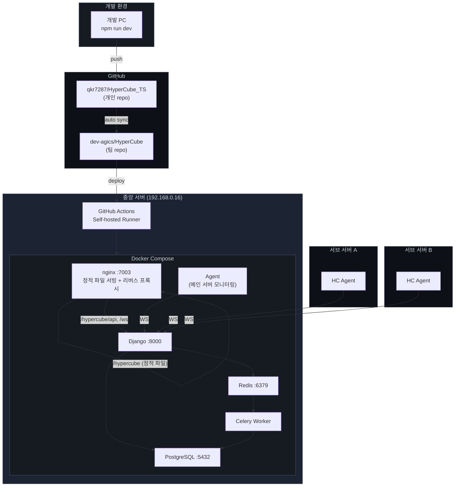

### 포트 & 네트워크

| 구성 요소 | 주소 | 포트 | 프로토콜 | 비고 |
|-----------|------|------|----------|------|
| nginx | 192.168.0.16 | 7003 | HTTP | 정적 파일 서빙 + 리버스 프록시, 기존 서비스와 공존 |
| Backend | Docker 내부 | 8000 | HTTP + WS | Django + Channels (uvicorn) |
| PostgreSQL | Docker 내부 | 5432 | TCP | 데이터 영구 저장, pgvector |
| Celery Worker | Docker 내부 | - | - | AI 분석 (같은 Django 코드) |
| Redis | Docker 내부 | 6379 | TCP | Celery 큐 + 실시간 데이터 캐시 |
| Agent (메인) | Docker 내부 | - | WS | Backend :8000에 WS 연결 |
| Agent (서브) → nginx | 외부 | 7003 | WS | /hypercube/ws 경로로 연결 |
| Agent → Docker | localhost | unix socket | - | docker.sock |

---

## 6. Phase별 구현 범위

> **WBS & Gantt 상세**: [Google Sheets](https://docs.google.com/spreadsheets/d/16Fx_Cef03RHAF6gmYK9verPP1x9UhJYZ3PRZ7wf99pU/edit?gid=1624286627#gid=1624286627)

- **개발 기간**: 3/24 ~ 5/29 (약 10주, 48 영업일)
- **테스트 기간**: 6/1 ~ 6/12 (2주, 10 영업일)
- **Demo 목표**: TBD

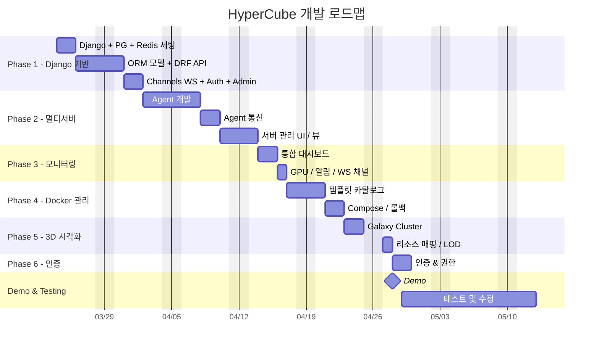

| Phase | 기간 | 핵심 목표 | 주요 산출물 |
|-------|------|----------|-----------|
| **Phase 1** ✅ | 3/24 ~ 4/2 | Django 기반 구축 | Django + DRF + Channels, PostgreSQL, Redis, Celery, Auth, Admin |
| **Phase 2** ✅ | 4/3 ~ 4/14 | 멀티서버 + 실시간 통합 | Agent 자동 등록, on-demand 명령 라우팅, 시스템 모달 4종 + 컨테이너 상세 모달 실데이터, 서버 전환 |
| **Phase 2.5** ✅ | 4/14 ~ 4/15 | Agent lifecycle / 알림 | last_seen + active grace + dormant archive + offline/online toast |
| **Phase 3 (재정의)** 🔵 | 4/15 ~ | 사용자/관리자/개발자 페이지 분리 + 컨테이너 lifecycle | Template / Request 모델, 승인 워크플로, Agent create/delete 명령, 사용자 페이지, 개발자 페이지 (/dev) |
| **Phase 4** | TBD | 모니터링 고도화 | GPU 메트릭, 알림 임계치, 멀티서버 그리드 뷰 |
| **Phase 5** | TBD | 3D 시각화 고도화 | Galaxy Cluster, 리소스 매핑, LOD, HUD |
| **Phase 6** | TBD | AI 분석 (Celery + pgvector) | 이상 탐지, 리소스 예측, 자연어 질의 |
| **Phase 7** | TBD | 외부 인증 연동 | SSO/OAuth → role 매핑, 감사 로그 |
| **Testing** | 각 Phase 종료 시 | 버그/성능/통합 | 자동화 테스트 + 회귀 검증 |

> 본 표는 docs 동기화 용도. 정본 일정은 [Google Sheets WBS](https://docs.google.com/spreadsheets/d/16Fx_Cef03RHAF6gmYK9verPP1x9UhJYZ3PRZ7wf99pU/edit?gid=1624286627#gid=1624286627)를 따른다.

---

## 7. As-Is vs To-Be 비교

| 항목 | As-Is (현재) | To-Be (목표) |
|------|-------------|-------------|
| 서버 구조 | SvelteKit 모놀리식 (API+UI 한 컨테이너) | nginx(정적 서빙) + Backend(Django) + Celery Worker + Redis + PostgreSQL + Agent 5컨테이너 분리 |
| Backend | SvelteKit API Routes | Django + DRF + Channels (Python) |
| 모니터링 범위 | 서버 1대 | 다수 서버 (메인 서버 포함) |
| 데이터 수집 | 중앙 서버가 직접 docker.sock 접근 | Agent가 각 서버에서 수집 후 전송 |
| 전송 방식 | REST polling + WebSocket | WebSocket Delta Sync + 글로벌 이벤트 채널 |
| 데이터베이스 | 없음 (stateless) | PostgreSQL + Redis (영구 저장 + 실시간 캐시) |
| 인증 | 없음 (누구나 접근) | JWT 기반 2단계 role (admin / user) |
| 사용자 화면 | 단일 화면 | 역할별 분리 (관리자 페이지 / 사용자 페이지 / 개발자 페이지) |
| Docker 배포 | 수동 (CLI 또는 Agent 직접 발견) | 사용자 요청 → 관리자 승인 → Agent가 create_container/compose_up 실행 |
| Docker 삭제 | 수동 | 사용자 요청 → 관리자 승인 → Agent가 delete_container/compose_down 실행 |
| 컨테이너 소유 | 익명 (Agent가 발견한 모든 것 admin이 봄) | 요청자(`requester` FK)와 요청(`created_via_request` FK) 추적, 사용자는 자기 것만 표시 |
| Agent 등록 | 수동 승인 단계 필요 | 자동 승인 (token 즉시 발급) |
| Agent 좀비 청소 | 수동 | 5분 grace → UI에서 사라짐, 7일 → archived, 37일 → hard delete |
| 3D 시각화 | 프로젝트-컨테이너 2계층 | 서버-프로젝트-컨테이너 3계층 (Galaxy Cluster) |
| 알림 | 없음 | Toast + 헤더 배지 (현재: agent online/offline, 향후: 임계치 기반 확장) |
| 감사 | 없음 | 전체 작업 감사 로그 |
