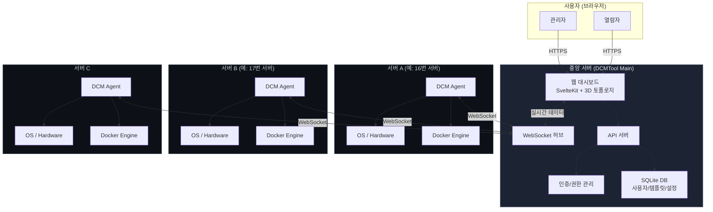
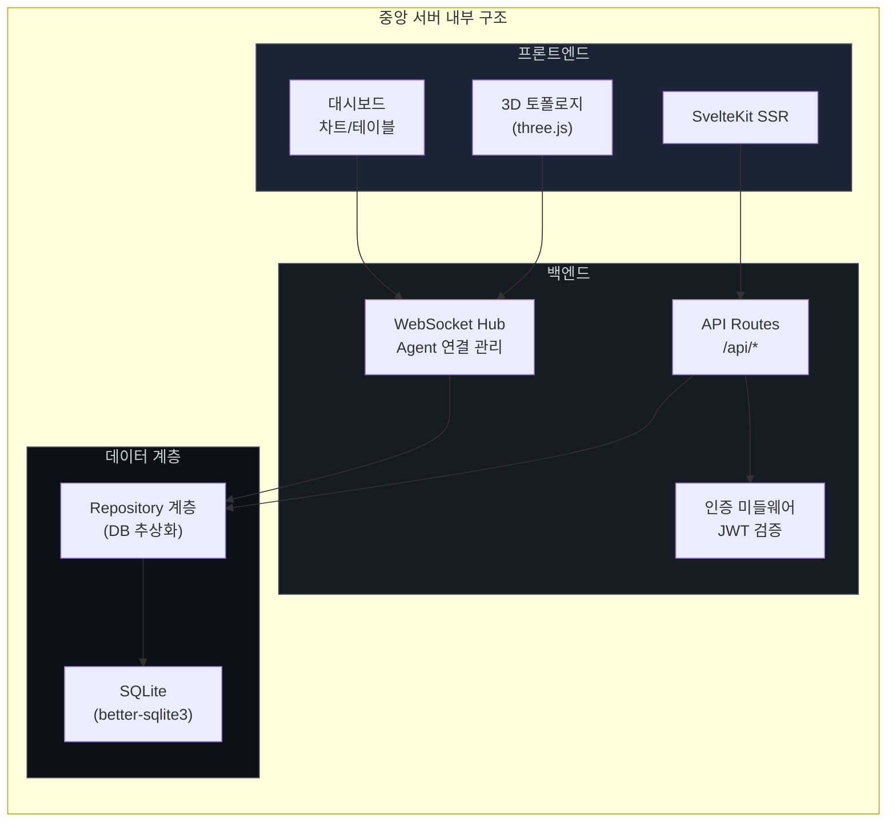
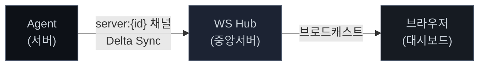
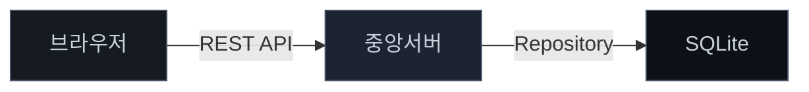
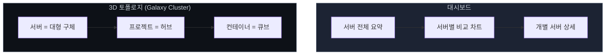
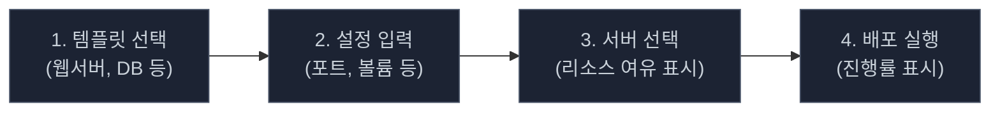
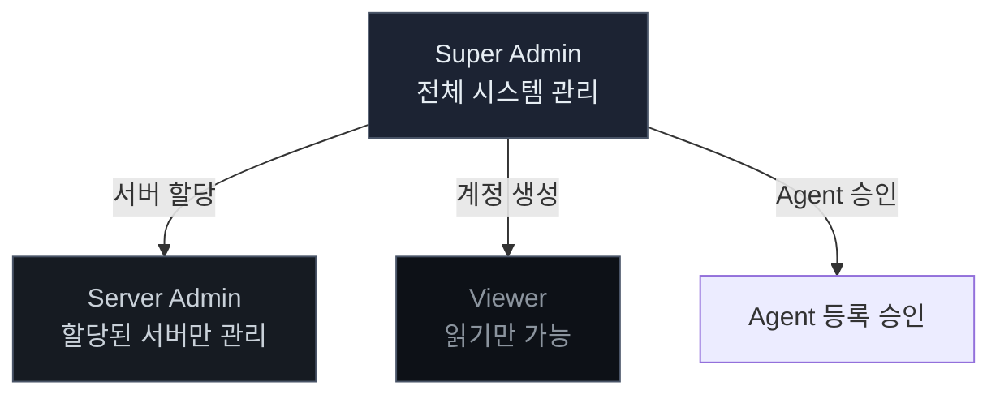
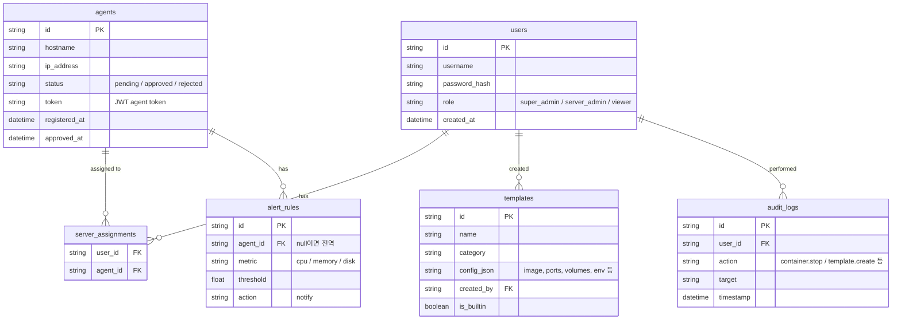
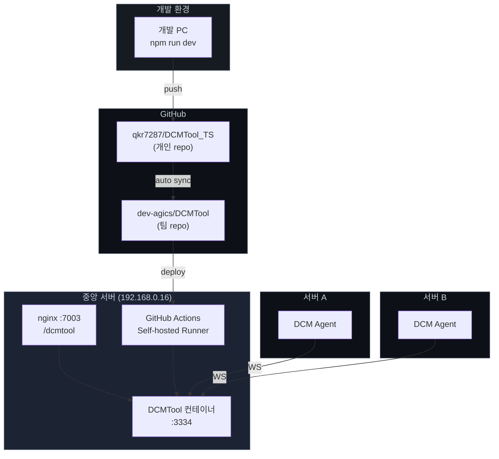
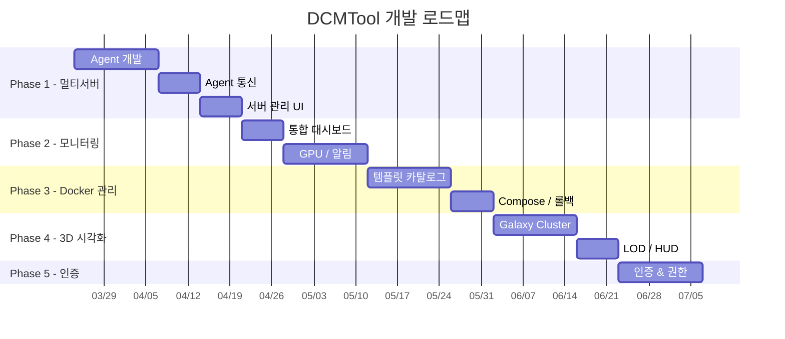

# DCMTool To-Be 시스템 아키텍처

> 이 문서는 DCMTool의 **목표 시스템 구조**를 정의합니다.
> 비개발자도 전체 그림을 이해할 수 있도록 작성했으며, 각 섹션 하단에 개발자용 상세 내용을 포함합니다.

---

## 1. 한눈에 보는 전체 구조

### 쉽게 말하면

현재 DCMTool은 **서버 1대만** 모니터링합니다.
To-Be는 **여러 서버를 하나의 대시보드**에서 모니터링하고 관리하는 시스템입니다.

각 서버에 "Agent"라는 작은 프로그램을 설치하면, Agent가 해당 서버의 상태를 수집해서 중앙 서버로 보내줍니다. 관리자는 웹 브라우저 하나로 모든 서버의 상태를 한눈에 확인하고, Docker 컨테이너를 생성/관리할 수 있습니다.

### 전체 시스템 구성도



---

## 2. 핵심 구성 요소

### 2.1 DCM Agent (각 서버에 설치)

#### 역할

Agent는 각 서버에 설치되는 **경량 데이터 수집기**입니다.
서버의 CPU, 메모리, 디스크 상태와 Docker 컨테이너 정보를 수집하여 중앙 서버로 전송합니다.

#### 동작 흐름


#### 개발자 상세

| 항목 | 내용 |
|------|------|
| 런타임 | Node.js (경량 데몬) |
| 배포 | Docker 컨테이너 (docker-compose) |
| Docker 수집 | dockerode 싱글톤 인스턴스 |
| System 수집 | /proc 직접 읽기 (컨테이너 마운트) 또는 호스트 직접 실행 |
| 데이터 전송 | WebSocket, Delta Sync (변경분만 전송) |
| 재접속 | 전체 스냅샷 1회 전송으로 정합성 보장 |
| 인증 | JWT agent token (auto-register 후 발급) |

```yaml
# Agent docker-compose.yml
services:
  dcm-agent:
    image: dcmtool/agent:latest
    restart: unless-stopped
    privileged: true
    pid: host
    volumes:
      - /var/run/docker.sock:/var/run/docker.sock:ro
      - /proc:/host/proc:ro
      - /etc/hostname:/host/etc/hostname:ro
      - /var/run/utmp:/var/run/utmp:ro
    environment:
      - DCM_SERVER_URL=http://central-server:3334
```

---

### 2.2 중앙 서버 (DCMTool Main)

#### 역할

모든 Agent의 데이터를 수신하고, 웹 대시보드를 통해 사용자에게 보여주는 **허브** 역할입니다.

#### 구성 요소



#### 개발자 상세

| 항목 | 내용 |
|------|------|
| 프레임워크 | SvelteKit 2 + Svelte 5 (runes mode) |
| 빌드 | adapter-node, Docker 컨테이너 배포 |
| WebSocket | server.js에서 HTTP upgrade 핸들링 |
| DB | SQLite (better-sqlite3), Repository 패턴으로 추상화 |
| 인증 | JWT (사용자 세션 + Agent 토큰) |
| 3D | 3d-force-graph + three.js |

**Repository 패턴 (DB 교체 대비)**

```
서비스 계층 → Repository 인터페이스 → SQLite 구현체
                                    → (향후) PostgreSQL 구현체
```

서비스 코드는 SQL을 직접 호출하지 않고, Repository 메서드만 사용합니다.
향후 DB를 교체할 때 구현체만 바꾸면 됩니다.

---

### 2.3 데이터 흐름

#### 실시간 모니터링 데이터 (WebSocket)

DB를 거치지 않고 Agent에서 브라우저까지 실시간 전달됩니다.



전송 데이터 (통합 메시지):

```json
{
  "type": "system",
  "serverId": "server-16",
  "timestamp": "2026-03-24T10:00:00Z",
  "cpu": { "usage": 45.2, "cores": [30, 50, 40, 60] },
  "memory": { "total": 16384, "used": 8192, "percent": 50.0 },
  "disk": { "total": "500G", "used": "200G", "percent": 40 },
  "network": { "rx": 102400, "tx": 51200 },
  "containers": [
    { "id": "abc123", "name": "nginx", "status": "running", "cpu": 2.1, "memory": 128 }
  ]
}
```

#### 설정/관리 데이터 (REST + SQLite)

사용자 계정, 템플릿, 알림 설정 등은 REST API를 통해 DB에 저장됩니다.



---

## 3. 주요 기능

### 3.1 멀티서버 모니터링



| 기능 | 설명 |
|------|------|
| 서버 통합 뷰 | 모든 서버의 CPU/Mem/Disk를 한 화면에서 요약 |
| 서버 비교 | 서버 간 리소스 사용량을 차트로 비교 |
| 서버 전환 | 헤더 드롭다운으로 특정 서버 선택, 기존 뷰 그대로 사용 |
| GPU 모니터링 | nvidia-smi 연동 (GPU 있는 서버만) |
| 알림 | CPU/Mem/Disk 임계치 초과 시 알림 발생 |

### 3.2 3D 시각화 (Galaxy Cluster)

#### 쉽게 말하면

서버를 **은하계**처럼 시각화합니다.
서버는 큰 행성, 프로젝트는 위성 허브, 컨테이너는 작은 큐브로 표시됩니다.
색상과 크기로 서버 상태를 직관적으로 파악할 수 있습니다.

#### 리소스 시각 매핑

| 리소스 | 시각 표현 |
|--------|----------|
| CPU 사용률 | 색상 그라디언트 (청록 → 노랑 → 주황 → 빨강) |
| Memory | 서버: glow 반경 / 컨테이너: 노드 크기 |
| 위험 상태 | 펄스 애니메이션 + 경고 링 |

#### LOD (Level of Detail) - 줌 레벨별 표시

| 거리 | 표시 내용 |
|------|----------|
| 멀리 (>400) | 서버 노드만 보임, 색상/크기로 부하 판단 |
| 중간 (150~400) | 서버 + 프로젝트 허브, 컨테이너는 점으로 표시 |
| 가까이 (<150) | 모든 노드 풀 렌더링 + 미니 게이지 바 |

#### 컨테이너 그룹핑 우선순위

| 순위 | 방식 | 설명 |
|------|------|------|
| 1 | `com.docker.compose.project` | Docker Compose 프로젝트 기준 |
| 2 | `dcm.group` 라벨 | 사용자가 직접 지정한 그룹 |
| 3 | Docker network | 같은 네트워크에 속한 컨테이너 |
| 4 | Image prefix | 이미지 이름 앞부분 기준 |
| 5 | 컨테이너명 prefix | 이름 앞부분 기준 (fallback) |

### 3.3 비전문가용 Docker 관리

#### 쉽게 말하면

Docker를 모르는 사람도 "**템플릿 고르고 → 설정 입력하고 → 서버 선택하고 → 배포**" 4단계로 컨테이너를 만들 수 있습니다.

#### 배포 흐름



| 기능 | 설명 |
|------|------|
| 템플릿 카탈로그 | 카테고리별 내장 템플릿 (웹서버, DB, 개발도구 등) |
| 커스텀 템플릿 | Super Admin이 추가/수정/삭제 가능 |
| 서버 리소스 표시 | 배포할 서버 선택 시 CPU/Mem 여유량 확인 가능 |
| Compose 지원 | 복합 서비스는 내부적으로 Compose 활용, 고급 사용자는 직접 편집 |
| 업데이트 | 이미지 최신 버전 확인 + 원클릭 업데이트 |
| 롤백 | 이전 이미지로 되돌리기 (히스토리 관리) |

### 3.4 인증 & 권한

#### 권한 구조



| 역할 | 할 수 있는 것 | 할 수 없는 것 |
|------|-------------|-------------|
| **Super Admin** | 모든 서버 관리, 사용자 관리, Agent 승인, 시스템 설정, 커스텀 템플릿 관리 | - |
| **Server Admin** | 할당받은 서버의 컨테이너 관리, 배포, 모니터링 | 다른 서버 접근, 사용자 관리, 시스템 설정 |
| **Viewer** | 모든 서버 모니터링 (읽기 전용) | 컨테이너 제어, 배포, 설정 변경 |

---

## 4. 데이터 저장 구조

### 실시간 vs 영구 데이터

| 데이터 | 저장 위치 | 이유 |
|--------|----------|------|
| CPU/Mem/Disk 메트릭 | WebSocket (메모리) | 실시간 표시용, 저장 불필요 |
| 컨테이너 상태 | WebSocket (메모리) | 실시간 표시용, 저장 불필요 |
| Agent 등록 정보 | SQLite | 서버 재시작 후에도 유지 필요 |
| 사용자 계정/권한 | SQLite | 영구 보관 |
| 템플릿 | SQLite | JSON 형태로 저장 |
| 알림 설정 | SQLite | 서버/전역 임계치 |
| 알림 히스토리 | SQLite | 이력 조회용 |
| 감사 로그 | SQLite | who/when/what 기록 |

### DB 스키마 (주요 테이블)



---

## 5. 네트워크 & 배포 구조

### To-Be 배포 구성도



### 포트 & 네트워크

| 구성 요소 | 주소 | 포트 | 프로토콜 |
|-----------|------|------|----------|
| nginx | 192.168.0.16 | 7003 | HTTP (reverse proxy) |
| DCMTool 중앙 서버 | 192.168.0.16 | 3334 | HTTP + WebSocket |
| Agent → 중앙 서버 | - | 3334 | WebSocket (server:{id}) |
| Agent → Docker | localhost | unix socket | docker.sock |
| Agent 내부 헬스체크 | localhost | 자동 할당 | HTTP /health |

---

## 6. Phase별 구현 범위



| Phase | 핵심 목표 | 주요 산출물 |
|-------|----------|-----------|
| **Phase 1** | 멀티서버 아키텍처 | Agent, Auto-register, 서버 관리 UI, 통합 뷰 |
| **Phase 2** | 모니터링 고도화 | 통합 대시보드, GPU 모니터링, 알림 시스템, WS 통합 채널 |
| **Phase 3** | 비전문가 Docker 관리 | 템플릿 카탈로그, Compose 관리, 업데이트/롤백 |
| **Phase 4** | 3D 시각화 고도화 | Galaxy Cluster, 리소스 매핑, LOD, HUD |
| **Phase 5** | 인증 & 권한 | 3단계 권한, 감사 로그 |

---

## 7. As-Is vs To-Be 비교

| 항목 | As-Is (현재) | To-Be (목표) |
|------|-------------|-------------|
| 모니터링 범위 | 서버 1대 | 다수 서버 |
| 데이터 수집 | 중앙 서버가 직접 docker.sock 접근 | Agent가 각 서버에서 수집 후 전송 |
| 전송 방식 | REST polling + WebSocket | WebSocket Delta Sync |
| 데이터베이스 | 없음 (stateless) | SQLite (사용자/템플릿/설정) |
| 인증 | 없음 (누구나 접근) | JWT 기반 3단계 권한 |
| Docker 배포 | 수동 (CLI) | 템플릿 카탈로그 + 마법사 UI |
| 3D 시각화 | 프로젝트-컨테이너 2계층 | 서버-프로젝트-컨테이너 3계층 (Galaxy Cluster) |
| 알림 | 없음 | 임계치 기반 알림 시스템 |
| 감사 | 없음 | 전체 작업 감사 로그 |
